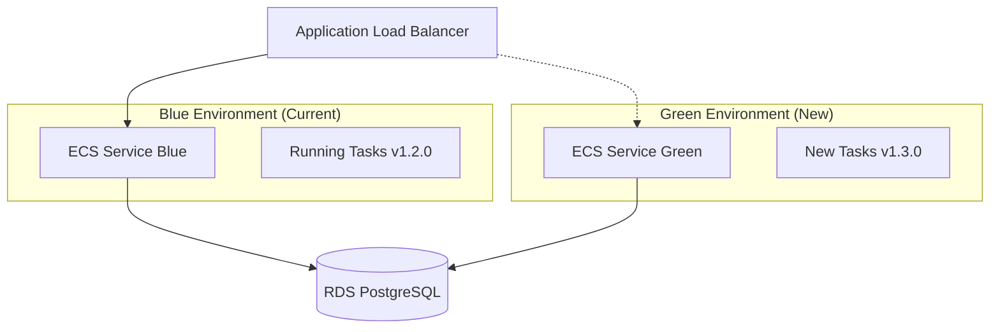

# Deployment and Rollback Strategy

## Overview

Our deployment strategy prioritizes zero-downtime deployments with the ability to quickly rollback both application and database changes. This is critical for a compliance engine where uptime and data integrity are paramount.

## Application Deployment Strategy

### Blue-Green Deployment with ECS



**Deployment Process:**
1. Deploy new version to Green environment
2. Run health checks and smoke tests
3. Gradually shift traffic (10% → 50% → 100%)
4. Monitor metrics and error rates
5. Keep Blue environment running for quick rollback

**Rollback Time:** < 30 seconds (traffic shift)

## Database Migration Strategy

### Forward-Compatible Migrations Only

**Core Principle:** All database changes must be backward compatible with the previous application version.

### Migration Phases

#### Phase 1: Additive Changes (Deploy New Schema)
```sql
-- Example: Adding a new column
-- ✅ Safe - existing code continues to work
ALTER TABLE license_records 
ADD COLUMN verification_metadata JSONB DEFAULT '{}'::jsonb;

-- ✅ Safe - new stored procedure
CREATE OR REPLACE FUNCTION get_enhanced_license_data(...)
RETURNS TABLE (...) AS $$...$$;
```

#### Phase 2: Application Deployment
- Deploy application that can use both old and new schema features
- New code uses new columns/procedures when available
- Gracefully handles missing features

#### Phase 3: Cleanup (Optional)
```sql
-- Only after confirming rollback window has passed
-- ⚠️ Breaking change - only after 30+ days
DROP FUNCTION IF EXISTS old_license_verification(...);
```

### Migration Rules

**✅ Always Safe:**
- Adding new tables
- Adding new columns with defaults
- Adding new indexes
- Adding new stored procedures
- Adding new constraints (NOT NULL with defaults)
- Expanding column sizes (VARCHAR(100) → VARCHAR(200))

**⚠️ Requires Careful Planning:**
- Renaming columns (use views for compatibility)
- Changing column types (requires data migration)
- Adding foreign keys to existing tables

**❌ Never Allowed:**
- Dropping columns used by current production code
- Dropping tables used by current production code
- Changing column types incompatibly
- Adding NOT NULL constraints without defaults

## Rollback Strategies

### 1. Application Rollback (< 1 minute)

**Automatic Rollback Triggers:**
- Health check failures > 3 consecutive attempts
- Error rate > 5% sustained for 2 minutes
- Response time > 2x baseline for 5 minutes
- Circuit breaker open state

**Process:**
```bash
# Immediate traffic shift back to Blue
aws elbv2 modify-listener --listener-arn $LISTENER_ARN \
  --default-actions TargetGroupArn=$BLUE_TARGET_GROUP

# Or using our deployment script
./scripts/deploy.sh rollback --immediate
```

### 2. Database Rollback (Complex)

**Hot Rollback (< 5 minutes):**
- Only possible if migrations were additive
- Application switches to previous stored procedure versions
- New columns/tables remain but unused

**Cold Rollback (15-30 minutes):**
- Restore from point-in-time backup
- Requires downtime
- Last resort only

### 3. Data Migration Rollback

For complex data migrations, we use shadow tables:

```sql
-- Create shadow table with new structure
CREATE TABLE license_records_new AS 
SELECT *, migrate_legacy_data(raw_data) as structured_data 
FROM license_records;

-- Application can read from both tables during transition
-- Only switch primary table after validation
```

## Implementation

### 1. Alembic Migration Templates

Let me create migration templates that enforce our safety rules:

```python
# backend/alembic/script.py.mako - Enhanced template
"""${message}

Revision ID: ${up_revision}
Revises: ${down_revision | comma,n}
Create Date: ${create_date}

MIGRATION SAFETY CHECKLIST:
- [ ] Changes are backward compatible
- [ ] No columns/tables are dropped
- [ ] New columns have appropriate defaults
- [ ] Stored procedures maintain existing signatures
- [ ] Migration can be rolled back safely
"""

def upgrade() -> None:
    # Always wrap in transaction for rollback safety
    with op.get_context().autocommit_block():
        ${upgrades if upgrades else "pass"}

def downgrade() -> None:
    # Downgrade should only undo additive changes
    with op.get_context().autocommit_block():
        ${downgrades if downgrades else "pass"}
```

### 2. Deployment Scripts

Create scripts that enforce our deployment strategy:

**scripts/deploy.sh:**
```bash
#!/bin/bash
set -e

ENVIRONMENT=${1:-staging}
ACTION=${2:-deploy}

case $ACTION in
  "deploy")
    echo "🚀 Starting blue-green deployment to $ENVIRONMENT"
    ./scripts/health-check.sh pre-deploy
    ./scripts/migrate.sh $ENVIRONMENT
    ./scripts/deploy-green.sh $ENVIRONMENT
    ./scripts/health-check.sh post-deploy
    ./scripts/traffic-shift.sh $ENVIRONMENT
    ;;
  "rollback")
    echo "🔄 Rolling back $ENVIRONMENT"
    ./scripts/traffic-shift.sh $ENVIRONMENT --rollback
    ./scripts/health-check.sh post-rollback
    ;;
  *)
    echo "Usage: $0 {staging|production} {deploy|rollback}"
    exit 1
    ;;
esac
```

### 3. Health Check Framework

**scripts/health-check.sh:**
```bash
#!/bin/bash

check_database_health() {
  # Test stored procedures work
  docker exec compliance-engine-postgres psql -U postgres -d compliance_engine -c \
    "SELECT health_check_database();"
}

check_api_health() {
  # Test API endpoints
  curl -f http://localhost:8000/health/deep || exit 1
}

check_migration_compatibility() {
  # Ensure old app version still works with new schema
  # This prevents data corruption during rollback
}
```

## Monitoring and Alerting

### Deployment Metrics
- Deployment duration
- Rollback frequency
- Error rates during deployment
- Database migration time

### Alerts
- Failed health checks during deployment
- Automatic rollback triggered
- Database migration failures
- Extended deployment times

## Database Backup Strategy

### Automated Backups
- **Point-in-time recovery:** Enabled with 35-day retention
- **Daily full backups:** Automated via RDS
- **Pre-deployment snapshots:** Created before each migration

### Recovery Testing
- Monthly restore tests to verify backup integrity
- Automated validation of restored data
- Documentation of recovery procedures

## Disaster Recovery

### RTO (Recovery Time Objective): 15 minutes
### RPO (Recovery Point Objective): 5 minutes

**Multi-AZ Deployment:**
- Primary RDS in us-east-1a
- Standby replica in us-east-1b
- Read replicas for reporting workloads

**Cross-Region Backup:**
- Daily backups replicated to us-west-2
- Infrastructure as Code allows full environment recreation

## Compliance Considerations

### Audit Requirements
- All deployments logged with approval chains
- Database changes tracked in audit.system_events_log
- Rollback decisions documented with business impact

### Data Integrity
- Foreign key constraints maintained during migrations
- Stored procedure signatures preserved for API stability
- No data loss during rollback procedures

This strategy ensures we can confidently deploy changes while maintaining the ability to quickly recover from any issues.