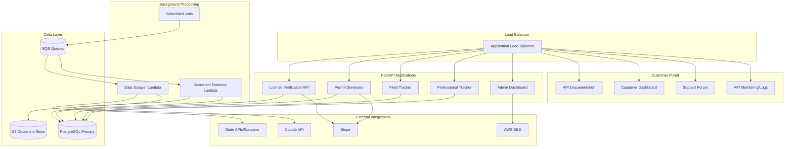
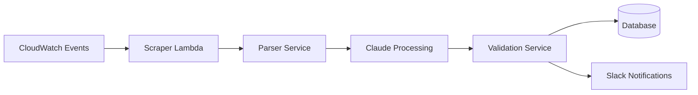

# Shared Technical Architecture

## Core Principles

### Multi-Region from Day 1
- Build architecture for multi-region deployment
- Deploy single region initially (us-east-1) to minimize costs
- Test multi-region in dev/staging to validate architecture
- Scale to additional regions when revenue justifies cost ($10K+ MRR)

### Shared Data Pipeline
- Common jurisdiction data collection and processing
- Standardized data models across all products
- Centralized cache layer for performance and cost optimization
- Automated data refresh and validation workflows

## Development Principles

### Testing-First Architecture
- **Unit test coverage**: Minimum 90% for business logic, 100% for critical paths
- **SOLID principles**: Dependency injection, interface segregation, single responsibility
- **Repository pattern**: Abstract data access for easy testing with in-memory implementations
- **Factory pattern**: Consistent test data generation
- **Dependency inversion**: Services depend on abstractions, not concrete implementations

See `testing-architecture.md` for detailed patterns and examples.

## Technology Stack

### Backend Services
```
Language: Python (FastAPI)
Rationale: 
- Rapid development for solo founder
- Excellent LLM/AI ecosystem integration
- Rich libraries for document processing, web scraping
- Single language across entire backend
- Performance adequate for target scale (1M requests/day)
- HTMX for frontend (server-rendered Jinja2 templates)
```

### Background Processing
```
Language: Python (Lambda functions + background workers)
Rationale:
- Consistent with API backend (shared code, models, utilities)
- Excellent for data extraction workflows
- Serverless Lambda for cost-effective batch processing
- Can scale to ECS/Fargate workers if needed
```

### Infrastructure
```
Language: TypeScript (CDK)
Rationale:
- Mature AWS CDK support
- Type safety for infrastructure definitions
- Easy to version control and review infrastructure changes
```

### Database Strategy
```
Primary: PostgreSQL 
- Multi-region architecture with read replicas
- JSONB columns for flexible jurisdiction data
- Strong consistency for compliance-critical data
- Proven at scale (Avalara patterns)

Cache: In-memory + PostgreSQL (Phase 1)
- Python LRU cache for jurisdiction lookups
- PostgreSQL materialized views for expensive queries
- Add Redis later for real-time features (>100K req/day)
```

### LLM Strategy
```
Primary: Claude Haiku
- Cost-effective for high-volume processing ($0.014 vs $0.054 for Sonnet)
- Sufficient accuracy for data extraction (70-80% success rate)
- Fast response times for real-time APIs

Escalation: Claude Sonnet
- Complex document parsing when Haiku confidence is low
- Human-in-the-loop verification workflows
- Quality assurance and training data generation
```

## System Architecture



## Data Models

### Core Entities

```sql
-- Jurisdictions (states, counties, cities)
CREATE TABLE jurisdictions (
    id UUID PRIMARY KEY,
    name TEXT NOT NULL,
    type TEXT NOT NULL, -- state, county, city
    parent_id UUID REFERENCES jurisdictions(id),
    metadata JSONB,
    created_at TIMESTAMP DEFAULT NOW()
);

-- License/permit requirements by jurisdiction
CREATE TABLE requirements (
    id UUID PRIMARY KEY,
    jurisdiction_id UUID REFERENCES jurisdictions(id),
    requirement_type TEXT NOT NULL, -- license, permit, registration
    category TEXT NOT NULL, -- electrical, plumbing, vehicle, etc.
    fields JSONB NOT NULL, -- structured requirement fields
    confidence_score FLOAT NOT NULL,
    source_url TEXT,
    last_verified TIMESTAMP,
    created_at TIMESTAMP DEFAULT NOW()
);

-- Customer organizations
CREATE TABLE organizations (
    id UUID PRIMARY KEY,
    name TEXT NOT NULL,
    plan_type TEXT NOT NULL,
    billing_customer_id TEXT, -- Stripe customer ID
    created_at TIMESTAMP DEFAULT NOW()
);

-- API usage tracking
CREATE TABLE api_usage (
    id UUID PRIMARY KEY,
    organization_id UUID REFERENCES organizations(id),
    endpoint TEXT NOT NULL,
    request_count INTEGER NOT NULL,
    period_start TIMESTAMP NOT NULL,
    period_end TIMESTAMP NOT NULL
);
```

## Deployment Architecture

### Phase 1: AWS Minimal (MVP)
```
- ECS Fargate container (0.25 vCPU, 512MB RAM)
- RDS PostgreSQL t3.micro (20GB storage)
- Lambda for background processing
- S3 for document storage
- CloudFront for static assets
- Route 53 for DNS

Estimated monthly cost:
- RDS t3.micro: $13
- ECS Fargate: $10-15
- Lambda: $1-5
- S3: $1-3
- CloudFront/Route53: $2-5
- Data transfer: $2-5
Total: ~$30-50/month at 1K requests/day
```

### Phase 2: AWS Native (Growth)
```
When: >100K requests/day or $15K+ MRR
- ECS Fargate with auto-scaling
- RDS with read replicas
- ALB for load balancing
- ElastiCache Redis cluster (if needed for real-time features)

Cost: ~$400-600/month at 100K+ requests/day
```

### Phase 3: Multi-Region (Scale)
```
When: >1M requests/day or $50K+ MRR
Primary: us-east-1
Secondary: us-west-2

Cross-region replication:
- RDS cross-region read replicas
- S3 cross-region replication
- Route 53 health checks and failover
- Regional cache warming

Additional cost: ~$300-500/month
```

## Data Collection Pipeline

### Automated Scraping


### Data Processing Workflow
1. **Collection**: Automated scraping of jurisdiction websites/APIs
2. **Extraction**: Claude Haiku processes raw documents
3. **Structuring**: Map unstructured text to standard data models  
4. **Validation**: Confidence scoring and quality checks
5. **Storage**: Versioned storage with change tracking
6. **Notification**: Alert on data changes or processing failures

## Scalability Patterns

### Caching Strategy
- **L1 Cache**: Application-level caching (5 min TTL)
- **L2 Cache**: Redis cluster caching (1 hour TTL)
- **L3 Cache**: CDN edge caching (24 hour TTL for static data)

### Queue Processing
- **SQS**: Async processing of scraping jobs
- **Dead Letter Queues**: Failed job handling and retry logic
- **Priority Queues**: Customer requests prioritized over batch processing

### Database Optimization
- **Read Replicas**: Route read queries to replicas by jurisdiction
- **Partitioning**: Partition large tables by jurisdiction or date
- **Indexing**: Composite indexes on commonly queried fields

## Security and Compliance

### API Security
- JWT-based authentication with short expiration
- Rate limiting per customer tier
- API key rotation and audit trails
- Request/response logging for compliance

### Data Protection
- Encryption at rest (RDS, S3, EBS)
- Encryption in transit (TLS 1.3)
- PII data retention policies
- GDPR/CCPA compliance workflows

### Infrastructure Security
- VPC with private subnets
- Security groups with least privilege
- WAF for application-layer protection
- CloudTrail for audit logging

## Monitoring and Observability

### Application Metrics
- API response times and error rates
- Data processing pipeline health
- Customer usage and billing metrics
- LLM token usage and costs

### Infrastructure Metrics
- ECS service health and resource utilization
- Database performance and connection pooling
- Cache hit rates and memory usage
- Network latency and throughput

### Alerting
- PagerDuty integration for critical issues
- Slack notifications for data processing failures
- Customer-facing status page for service health
- Budget alerts for cost overruns

## Cost Optimization

### Compute
- ECS Fargate for FastAPI applications with auto-scaling
- Lambda for all background processing (data scraping, document extraction)
- CloudWatch Events for scheduled tasks

### Storage
- S3 lifecycle policies (Standard → IA → Glacier)
- Database storage optimization and cleanup
- CloudFront caching reduces origin requests

### Third-Party Services
- Claude Haiku for cost-effective LLM processing
- Bulk API pricing negotiations with state services
- Reserved capacity for predictable workloads