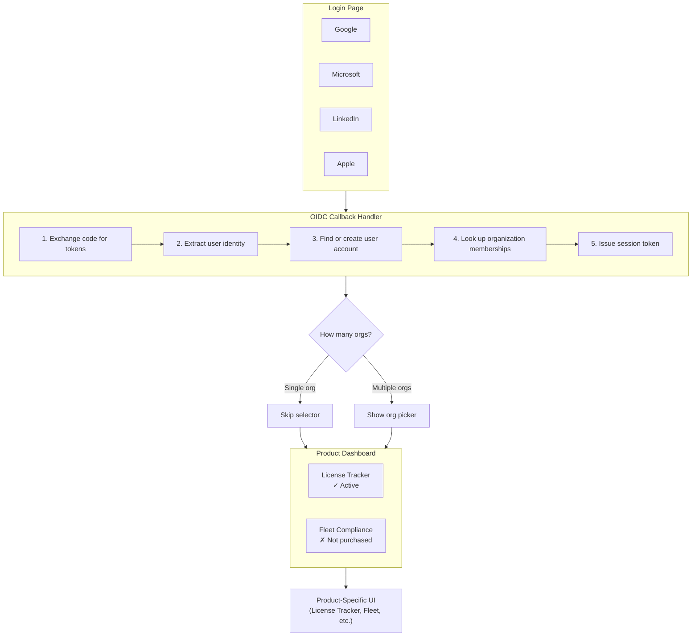
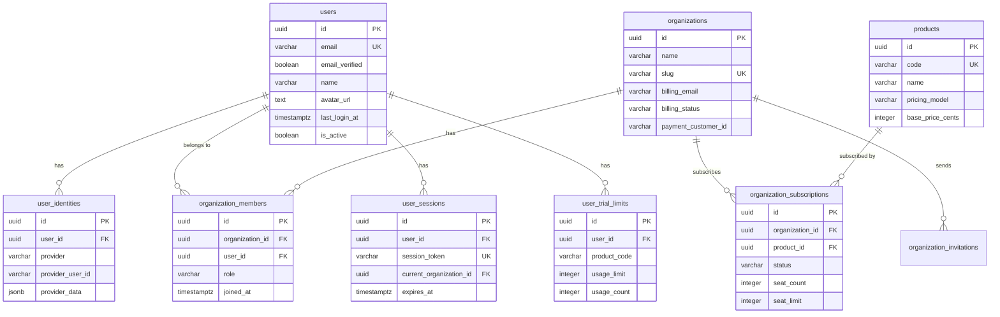

# Auth and Product Selection Architecture

## Current State

**What exists:**
- Platform admin auth (email/password, session-based)
- OIDC verification tracking for deployment gates
- API key auth for B2B API access
- OAuth flow utilities in frontend (popup-based)

**What's missing:**
- Customer user authentication via OIDC
- User ↔ Organization membership
- Organization ↔ Product subscriptions
- Seat-based billing model
- Product selection UI

## Target User Flow



## Data Model

### Entity Relationship Diagram



### Core Tables

```sql
-- Users authenticated via OIDC
CREATE TABLE users (
    id UUID PRIMARY KEY DEFAULT gen_random_uuid(),
    email VARCHAR(255) NOT NULL UNIQUE,
    email_verified BOOLEAN DEFAULT FALSE,
    name VARCHAR(255),
    avatar_url TEXT,
    created_at TIMESTAMPTZ DEFAULT NOW(),
    updated_at TIMESTAMPTZ DEFAULT NOW(),
    last_login_at TIMESTAMPTZ,
    is_active BOOLEAN DEFAULT TRUE
);

-- OIDC identity links (user can have multiple providers)
CREATE TABLE user_identities (
    id UUID PRIMARY KEY DEFAULT gen_random_uuid(),
    user_id UUID NOT NULL REFERENCES users(id) ON DELETE CASCADE,
    provider VARCHAR(50) NOT NULL,  -- 'google', 'microsoft', 'linkedin', 'apple'
    provider_user_id VARCHAR(255) NOT NULL,
    provider_email VARCHAR(255),
    provider_data JSONB,  -- filtered claims from provider (volatile claims excluded)
    created_at TIMESTAMPTZ DEFAULT NOW(),
    updated_at TIMESTAMPTZ DEFAULT NOW(),  -- tracks last login via this provider
    UNIQUE(provider, provider_user_id)
);

-- Organizations (tenants)
CREATE TABLE organizations (
    id UUID PRIMARY KEY DEFAULT gen_random_uuid(),
    name VARCHAR(255) NOT NULL,
    slug VARCHAR(100) UNIQUE,  -- URL-friendly identifier
    billing_email VARCHAR(255),
    billing_status VARCHAR(50) DEFAULT 'active',  -- active, past_due, canceled
    payment_provider VARCHAR(50),  -- 'stripe', etc.
    payment_customer_id VARCHAR(255),  -- Stripe customer ID (no card data stored)
    created_at TIMESTAMPTZ DEFAULT NOW(),
    updated_at TIMESTAMPTZ DEFAULT NOW(),
    is_active BOOLEAN DEFAULT TRUE
);

-- Organization membership with roles
CREATE TABLE organization_members (
    id UUID PRIMARY KEY DEFAULT gen_random_uuid(),
    organization_id UUID NOT NULL REFERENCES organizations(id) ON DELETE CASCADE,
    user_id UUID NOT NULL REFERENCES users(id) ON DELETE CASCADE,
    role VARCHAR(50) NOT NULL DEFAULT 'member',  -- 'owner', 'admin', 'member'
    invited_by UUID REFERENCES users(id),
    invited_at TIMESTAMPTZ,
    joined_at TIMESTAMPTZ DEFAULT NOW(),
    is_active BOOLEAN DEFAULT TRUE,
    UNIQUE(organization_id, user_id)
);

-- Product catalog
CREATE TABLE products (
    id UUID PRIMARY KEY DEFAULT gen_random_uuid(),
    code VARCHAR(50) NOT NULL UNIQUE,  -- 'license_verification_api', 'fleet_tracker', etc.
    name VARCHAR(255) NOT NULL,
    description TEXT,
    pricing_model VARCHAR(50) NOT NULL,  -- 'per_seat', 'per_request', 'flat_rate'
    base_price_cents INTEGER,
    is_active BOOLEAN DEFAULT TRUE,
    created_at TIMESTAMPTZ DEFAULT NOW()
);

-- Organization product subscriptions
CREATE TABLE organization_subscriptions (
    id UUID PRIMARY KEY DEFAULT gen_random_uuid(),
    organization_id UUID NOT NULL REFERENCES organizations(id) ON DELETE CASCADE,
    product_id UUID NOT NULL REFERENCES products(id),
    status VARCHAR(50) NOT NULL DEFAULT 'active',  -- 'active', 'canceled', 'past_due', 'trialing'
    seat_count INTEGER DEFAULT 1,
    seat_limit INTEGER,  -- NULL = unlimited
    payment_subscription_id VARCHAR(255),  -- Stripe subscription ID
    current_period_start TIMESTAMPTZ,
    current_period_end TIMESTAMPTZ,
    created_at TIMESTAMPTZ DEFAULT NOW(),
    canceled_at TIMESTAMPTZ,
    UNIQUE(organization_id, product_id)
);

-- Pending invitations
CREATE TABLE organization_invitations (
    id UUID PRIMARY KEY DEFAULT gen_random_uuid(),
    organization_id UUID NOT NULL REFERENCES organizations(id) ON DELETE CASCADE,
    email VARCHAR(255) NOT NULL,
    role VARCHAR(50) NOT NULL DEFAULT 'member',
    invited_by UUID NOT NULL REFERENCES users(id),
    token VARCHAR(255) NOT NULL UNIQUE,
    expires_at TIMESTAMPTZ NOT NULL,
    accepted_at TIMESTAMPTZ,
    created_at TIMESTAMPTZ DEFAULT NOW()
);

-- User sessions
CREATE TABLE user_sessions (
    id UUID PRIMARY KEY DEFAULT gen_random_uuid(),
    user_id UUID NOT NULL REFERENCES users(id) ON DELETE CASCADE,
    session_token VARCHAR(255) NOT NULL UNIQUE,
    current_organization_id UUID REFERENCES organizations(id),
    ip_address INET,
    user_agent TEXT,
    created_at TIMESTAMPTZ DEFAULT NOW(),
    expires_at TIMESTAMPTZ NOT NULL,
    last_activity_at TIMESTAMPTZ DEFAULT NOW()
);

-- Indexes
CREATE INDEX idx_user_identities_user ON user_identities(user_id);
CREATE INDEX idx_user_identities_provider ON user_identities(provider, provider_user_id);
CREATE INDEX idx_org_members_user ON organization_members(user_id);
CREATE INDEX idx_org_members_org ON organization_members(organization_id);
CREATE INDEX idx_org_subscriptions_org ON organization_subscriptions(organization_id);
CREATE INDEX idx_user_sessions_token ON user_sessions(session_token);
CREATE INDEX idx_user_sessions_user ON user_sessions(user_id);
CREATE INDEX idx_org_invitations_token ON organization_invitations(token);
CREATE INDEX idx_org_invitations_email ON organization_invitations(email);
```

### Stored Procedures

```sql
-- Volatile claims to exclude from storage (change on every login)
-- These are filtered out before storing/comparing claims
-- Examples: iat, exp, nbf, auth_time, nonce, at_hash, c_hash, sid
COMMENT ON TABLE user_identities IS 'Volatile OIDC claims excluded from provider_data: iat, exp, nbf, auth_time, nonce, at_hash, c_hash, sid, jti, acr, amr, azp';

-- Find or create user from OIDC callback
-- Claims are refreshed on every login; audit log entry created only when claims change
CREATE OR REPLACE FUNCTION authenticate_oidc_user(
    p_provider VARCHAR,
    p_provider_user_id VARCHAR,
    p_email VARCHAR,
    p_name VARCHAR,
    p_provider_data JSONB  -- Caller must filter volatile claims before passing
) RETURNS TABLE(
    user_id UUID,
    is_new_user BOOLEAN,
    organizations JSONB
) AS $$
DECLARE
    v_user_id UUID;
    v_identity_id UUID;
    v_is_new BOOLEAN := FALSE;
    v_old_claims JSONB;
    v_claims_changed BOOLEAN := FALSE;
BEGIN
    -- Check if identity already exists
    SELECT ui.user_id, ui.id, ui.provider_data
    INTO v_user_id, v_identity_id, v_old_claims
    FROM user_identities ui
    WHERE ui.provider = p_provider AND ui.provider_user_id = p_provider_user_id;

    IF v_user_id IS NULL THEN
        -- Check if user exists by email
        SELECT u.id INTO v_user_id
        FROM users u
        WHERE u.email = p_email;

        IF v_user_id IS NULL THEN
            -- Create new user
            INSERT INTO users (email, email_verified, name)
            VALUES (p_email, TRUE, p_name)
            RETURNING id INTO v_user_id;
            v_is_new := TRUE;
        END IF;

        -- Link identity to user (first login with this provider)
        INSERT INTO user_identities (user_id, provider, provider_user_id, provider_email, provider_data)
        VALUES (v_user_id, p_provider, p_provider_user_id, p_email, p_provider_data);
    ELSE
        -- Existing identity - check if claims changed
        v_claims_changed := (v_old_claims IS DISTINCT FROM p_provider_data);

        IF v_claims_changed THEN
            -- Update claims and log the change
            UPDATE user_identities
            SET provider_data = p_provider_data,
                provider_email = p_email,
                updated_at = NOW()
            WHERE id = v_identity_id;

            -- Audit the claims change (assumes audit_log table exists)
            INSERT INTO audit_log (action, entity_type, entity_id, old_value, new_value, created_at)
            VALUES (
                'oidc_claims_updated',
                'user_identity',
                v_identity_id,
                v_old_claims,
                p_provider_data,
                NOW()
            );
        ELSE
            -- No claims change, just update timestamp
            UPDATE user_identities
            SET updated_at = NOW()
            WHERE id = v_identity_id;
        END IF;
    END IF;

    -- Update last login
    UPDATE users SET last_login_at = NOW() WHERE id = v_user_id;

    -- Return user with their organizations
    RETURN QUERY
    SELECT
        v_user_id,
        v_is_new,
        COALESCE(
            (SELECT jsonb_agg(jsonb_build_object(
                'id', o.id,
                'name', o.name,
                'slug', o.slug,
                'role', om.role
            ))
            FROM organization_members om
            JOIN organizations o ON o.id = om.organization_id
            WHERE om.user_id = v_user_id AND om.is_active = TRUE AND o.is_active = TRUE),
            '[]'::jsonb
        );
END;
$$ LANGUAGE plpgsql;

-- Create user session
CREATE OR REPLACE FUNCTION create_user_session(
    p_user_id UUID,
    p_organization_id UUID,
    p_ip_address INET,
    p_user_agent TEXT,
    p_expires_hours INTEGER DEFAULT 168  -- 7 days
) RETURNS VARCHAR AS $$
DECLARE
    v_token VARCHAR;
BEGIN
    v_token := encode(gen_random_bytes(32), 'base64');

    INSERT INTO user_sessions (user_id, session_token, current_organization_id, ip_address, user_agent, expires_at)
    VALUES (p_user_id, v_token, p_organization_id, p_ip_address, p_user_agent, NOW() + (p_expires_hours || ' hours')::INTERVAL);

    RETURN v_token;
END;
$$ LANGUAGE plpgsql;

-- Validate session and get user context
CREATE OR REPLACE FUNCTION validate_user_session(
    p_session_token VARCHAR
) RETURNS TABLE(
    user_id UUID,
    email VARCHAR,
    name VARCHAR,
    current_organization_id UUID,
    current_organization_name VARCHAR,
    role VARCHAR,
    subscribed_products JSONB
) AS $$
BEGIN
    -- Update last activity
    UPDATE user_sessions
    SET last_activity_at = NOW()
    WHERE session_token = p_session_token AND expires_at > NOW();

    RETURN QUERY
    SELECT
        u.id,
        u.email,
        u.name,
        s.current_organization_id,
        o.name,
        om.role,
        COALESCE(
            (SELECT jsonb_agg(jsonb_build_object(
                'product_id', p.id,
                'code', p.code,
                'name', p.name,
                'status', os.status
            ))
            FROM organization_subscriptions os
            JOIN products p ON p.id = os.product_id
            WHERE os.organization_id = s.current_organization_id
              AND os.status IN ('active', 'trialing')),
            '[]'::jsonb
        )
    FROM user_sessions s
    JOIN users u ON u.id = s.user_id
    LEFT JOIN organizations o ON o.id = s.current_organization_id
    LEFT JOIN organization_members om ON om.organization_id = o.id AND om.user_id = u.id
    WHERE s.session_token = p_session_token
      AND s.expires_at > NOW()
      AND u.is_active = TRUE;
END;
$$ LANGUAGE plpgsql;

-- Get user's organizations with subscription info
CREATE OR REPLACE FUNCTION get_user_organizations(
    p_user_id UUID
) RETURNS TABLE(
    organization_id UUID,
    name VARCHAR,
    slug VARCHAR,
    role VARCHAR,
    products JSONB
) AS $$
BEGIN
    RETURN QUERY
    SELECT
        o.id,
        o.name,
        o.slug,
        om.role,
        COALESCE(
            (SELECT jsonb_agg(jsonb_build_object(
                'code', p.code,
                'name', p.name,
                'status', os.status
            ))
            FROM organization_subscriptions os
            JOIN products p ON p.id = os.product_id
            WHERE os.organization_id = o.id),
            '[]'::jsonb
        )
    FROM organization_members om
    JOIN organizations o ON o.id = om.organization_id
    WHERE om.user_id = p_user_id
      AND om.is_active = TRUE
      AND o.is_active = TRUE
    ORDER BY o.name;
END;
$$ LANGUAGE plpgsql;

-- Switch current organization
CREATE OR REPLACE FUNCTION switch_organization(
    p_session_token VARCHAR,
    p_organization_id UUID
) RETURNS BOOLEAN AS $$
DECLARE
    v_user_id UUID;
    v_is_member BOOLEAN;
BEGIN
    -- Get user from session
    SELECT user_id INTO v_user_id
    FROM user_sessions
    WHERE session_token = p_session_token AND expires_at > NOW();

    IF v_user_id IS NULL THEN
        RETURN FALSE;
    END IF;

    -- Verify membership
    SELECT EXISTS(
        SELECT 1 FROM organization_members
        WHERE user_id = v_user_id AND organization_id = p_organization_id AND is_active = TRUE
    ) INTO v_is_member;

    IF NOT v_is_member THEN
        RETURN FALSE;
    END IF;

    -- Update session
    UPDATE user_sessions
    SET current_organization_id = p_organization_id
    WHERE session_token = p_session_token;

    RETURN TRUE;
END;
$$ LANGUAGE plpgsql;
```

## API Endpoints

### Auth Endpoints (`/api/auth`)

```
POST /api/auth/oidc/callback
    Body: { provider, code, redirect_uri }
    Returns: { session_token, user, organizations }

GET /api/auth/me
    Header: Authorization: Bearer <session_token>
    Returns: { user, current_organization, subscribed_products }

POST /api/auth/switch-organization
    Header: Authorization: Bearer <session_token>
    Body: { organization_id }
    Returns: { success, current_organization, subscribed_products }

POST /api/auth/logout
    Header: Authorization: Bearer <session_token>
    Returns: { success }
```

### Organization Endpoints (`/api/organizations`)

```
GET /api/organizations
    Returns: list of user's organizations with roles

GET /api/organizations/:id
    Returns: organization details, members, subscriptions

POST /api/organizations/:id/invite
    Body: { email, role }
    Returns: { invitation_id }
    (Admin/Owner only, creates pending seat)

DELETE /api/organizations/:id/members/:user_id
    (Admin/Owner only, removes member)

GET /api/organizations/:id/products
    Returns: available products with subscription status
```

## Frontend Components

### New Pages

```
/login                  - OIDC provider selection
/auth/callback          - OAuth callback handler
/select-organization    - Org picker (if multi-org)
/dashboard              - Product dashboard (main landing after auth)
/[product]/...          - Product-specific routes
```

### Auth Context

```typescript
interface AuthState {
  user: User | null;
  currentOrganization: Organization | null;
  organizations: Organization[];
  subscribedProducts: Product[];
  isLoading: boolean;
}

interface AuthContextValue extends AuthState {
  login: (provider: OAuthProvider) => void;
  logout: () => void;
  switchOrganization: (orgId: string) => Promise<void>;
  hasProduct: (productCode: string) => boolean;
}
```

### Route Protection

```typescript
// Wrap product routes with subscription check
<ProductGuard productCode="professional_license_tracker">
  <LicenseTrackerApp />
</ProductGuard>

// Redirect to dashboard if no subscription
function ProductGuard({ productCode, children }) {
  const { subscribedProducts } = useAuth();
  const hasAccess = subscribedProducts.some(p => p.code === productCode && p.status === 'active');

  if (!hasAccess) {
    return <Navigate to="/dashboard" />;
  }
  return children;
}
```

## Implementation Order

### Phase 1: Core Auth (This Sprint)
1. Database migration for users, identities, sessions tables
2. OIDC callback endpoint with token exchange
3. Session validation middleware
4. Login page with provider buttons
5. Auth callback handler
6. Basic auth context in frontend

### Phase 2: Organizations
1. Database migration for orgs, members, invitations
2. Org CRUD stored procedures
3. Org management endpoints
4. Org selector page
5. Switch organization flow

### Phase 3: Products & Subscriptions
1. Products and subscriptions tables
2. Product dashboard page
3. Subscription status checking
4. Product route guards

### Phase 4: Billing Integration (TBD)
1. Stripe integration for payment tokens
2. Subscription management
3. Seat counting and enforcement
4. Billing portal link

## Security Considerations

1. **Session tokens** - 256-bit random, stored hashed in DB
2. **OIDC state parameter** - CSRF protection on OAuth flow
3. **Organization isolation** - All queries scoped to current org
4. **Role checks** - Owner/Admin required for member management
5. **Rate limiting** - On auth endpoints to prevent brute force
6. **Token expiry** - 7-day sessions with activity-based extension

## Design Decisions

1. **New user flow** - Auto-create a personal org using the OIDC `name` claim. User can rename later.

2. **Email domain matching** - No auto-assignment. Too many users will be `@gmail.com` or similar. Explicit invitation required.

3. **Free tier** - Yes. Limited lifetime usage per user (not per org). Limits stored in DB with configurable defaults. Usage tracking per user.

4. **Admin UI** - Internal admin UI needed to configure system-wide settings like trial limits. See GitHub Epic for details.

5. **OIDC claims refresh** - Claims are updated on every login. This captures changes like name updates, email changes, and profile picture refreshes. Volatile claims that change on every login are filtered out before storage:
   - `iat`, `exp`, `nbf` (timestamps)
   - `auth_time`, `nonce`, `at_hash`, `c_hash` (auth session values)
   - `sid`, `jti`, `acr`, `amr`, `azp` (session/auth context)

   Audit log entries are only created when claims actually change, not on every login. The `updated_at` timestamp on `user_identities` tracks the last login via that provider.

## Testing Strategy

### Docker-Based OIDC Mock Server

A real OIDC server running in Docker provides realistic auth testing that exercises the full OAuth flow—redirects, token exchange, JWKS validation, and claim parsing.

**Why Docker over built-in mocks:**
- Tests the actual OAuth redirect flow (not just the callback)
- Real JWT signing with JWKS endpoint validation
- Token expiration and refresh token handling
- Standard `.well-known/openid-configuration` discovery
- Catches integration issues that mocks hide

**Docker Compose configuration:**

```yaml
# docker-compose.yml
services:
  test-oidc:
    profiles: ["test"]
    image: ghcr.io/soluto/oidc-server-mock:latest
    ports:
      - "4011:80"
    environment:
      ASPNETCORE_ENVIRONMENT: Development
      SERVER_OPTIONS_INLINE: |
        {
          "AccessTokenJwtType": "JWT",
          "Discovery": {
            "ShowKeySet": true
          },
          "IssuerUri": "http://localhost:4011"
        }
      USERS_CONFIGURATION_INLINE: |
        [
          {
            "SubjectId": "test-alice-001",
            "Username": "alice",
            "Password": "test-password-123",
            "Claims": [
              { "Type": "name", "Value": "Alice Tester" },
              { "Type": "email", "Value": "alice@test.example" },
              { "Type": "email_verified", "Value": "true" },
              { "Type": "picture", "Value": "https://example.com/alice.png" }
            ]
          },
          {
            "SubjectId": "test-bob-002",
            "Username": "bob",
            "Password": "test-password-123",
            "Claims": [
              { "Type": "name", "Value": "Bob Tester" },
              { "Type": "email", "Value": "bob@test.example" },
              { "Type": "email_verified", "Value": "true" }
            ]
          },
          {
            "SubjectId": "test-charlie-003",
            "Username": "charlie",
            "Password": "test-password-123",
            "Claims": [
              { "Type": "name", "Value": "Charlie Multi" },
              { "Type": "email", "Value": "charlie@test.example" },
              { "Type": "email_verified", "Value": "true" }
            ]
          },
          {
            "SubjectId": "test-unverified-004",
            "Username": "unverified",
            "Password": "test-password-123",
            "Claims": [
              { "Type": "name", "Value": "Unverified User" },
              { "Type": "email", "Value": "unverified@test.example" },
              { "Type": "email_verified", "Value": "false" }
            ]
          }
        ]
      CLIENTS_CONFIGURATION_INLINE: |
        [
          {
            "ClientId": "compliance-engine-test",
            "ClientSecrets": ["test-client-secret"],
            "RedirectUris": [
              "http://localhost:3000/auth/callback",
              "http://localhost:8000/api/auth/oidc/callback"
            ],
            "AllowedScopes": ["openid", "profile", "email"],
            "AllowedGrantTypes": ["authorization_code", "refresh_token"]
          }
        ]
```

**Test scenarios:**

| User | Scenario |
|------|----------|
| `alice` / `alice@test.example` | Standard single-org user |
| `bob` / `bob@test.example` | Second user for invitation/collaboration tests |
| `charlie` / `charlie@test.example` | Multi-org user (org switcher tests) |
| `unverified` / `unverified@test.example` | Email not verified (edge case handling) |

All users share password: `test-password-123`

**Running tests:**

```bash
# Start test infrastructure (runs for entire test session)
docker compose --profile test up -d test-oidc postgres

# Wait for OIDC server to be ready
curl --retry 10 --retry-delay 1 --retry-connrefused \
  http://localhost:4011/.well-known/openid-configuration

# Run backend tests
cd backend && pytest

# Run e2e tests
cd frontend && npx playwright test

# Tear down
docker compose --profile test down
```

**CI configuration:**

```yaml
# .github/workflows/test.yml
jobs:
  test:
    services:
      postgres:
        image: postgres:15
        # ...
    steps:
      - name: Start OIDC mock
        run: docker compose --profile test up -d test-oidc

      - name: Wait for OIDC
        run: |
          timeout 30 bash -c 'until curl -s http://localhost:4011/.well-known/openid-configuration; do sleep 1; done'

      - name: Run tests
        run: |
          pytest
          npx playwright test
```

**Backend configuration for tests:**

```python
# backend/src/core/config.py
class Settings:
    # OIDC providers - test provider added when ENVIRONMENT=test
    OIDC_PROVIDERS: dict = {
        "google": {...},
        "microsoft": {...},
    }

    if ENVIRONMENT == "test":
        OIDC_PROVIDERS["test"] = {
            "issuer": "http://localhost:4011",
            "client_id": "compliance-engine-test",
            "client_secret": "test-client-secret",
            "authorization_endpoint": "http://localhost:4011/connect/authorize",
            "token_endpoint": "http://localhost:4011/connect/token",
            "jwks_uri": "http://localhost:4011/.well-known/openid-configuration/jwks",
        }
```

**Safety measures:**
- **Profile gated**: Container only starts with `--profile test`
- **Reserved TLD**: Uses `.example` per RFC 2606 (cannot conflict with real addresses)
- **Distinct provider**: Stored as `provider='test'` in `user_identities`
- **No production exposure**: Test OIDC provider config only loaded when `ENVIRONMENT=test`
